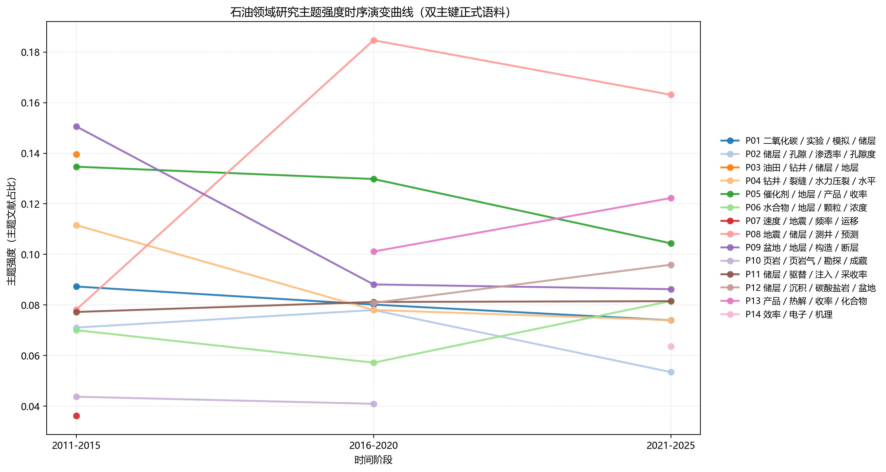
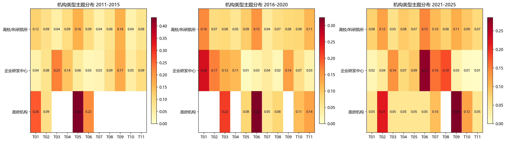
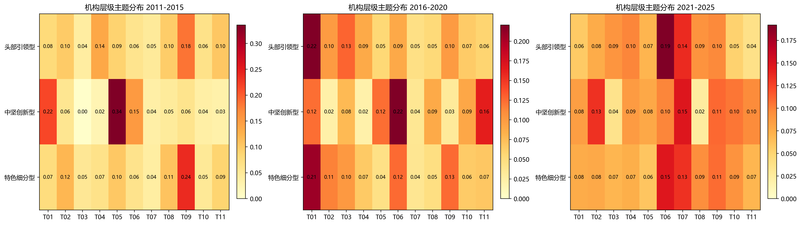

# 基于高质量期刊文献挖掘的全球石油领域研究机构学术影响力评价与主题演化分析

## 摘要
本文以已筛定的109本高质量期刊石油领域文献数据为基础数据源，整合CNKI、WOS与CSCD三库2011-2025年记录，构建覆盖311321篇文献的双主键去重正式语料。研究首先按照“标准DOI键优先、元数据回退键补充”的规则完成跨库去重，并通过机构译名清洗、标准化归并与子单元过滤构建机构分析底表；随后从科研产出、学术影响、合作与国际化三个维度提取7项指标，采用先验权重、熵权法与CRITIC法的组合赋权方案，通过TOPSIS对全球石油领域核心研究机构开展综合评价；最后基于103627篇建模文献，按2011-2015、2016-2020、2021-2025三个阶段构建LDA主题模型，分析研究热点演化路径以及不同机构类型、机构层级的主题偏好差异。结果表明：TOPSIS综合排名前两位分别为中国科学院和中国石油大学（北京），其中中国科学院综合得分为0.793235；机构画像环节共识别企业研发中心5309家、高校/科研院所2440家、政府机构2家；三阶段模型均选取11个主题，研究热点总体呈现出由盆地构造、油田开发与传统催化转化，逐步转向储层预测、低碳利用与高精度催化表征的趋势。高校/科研院所在知识探索型主题上更具优势，企业研发中心则更集中于工程开发与应用导向主题。研究为石油领域科研机构竞争力诊断、主题布局优化和资源配置决策提供了可复现的数据分析路径。

**关键词：**高质量期刊文献；石油领域；研究机构；学术影响力；主题演化

## Abstract
**Academic Influence Evaluation and Topic Evolution Analysis of Global Petroleum Research Institutions Based on High-Quality Journal Literature Mining**

Using literature records derived from 109 high-quality petroleum journals, this study integrates CNKI, Web of Science, and CSCD data from 2011 to 2025 and constructs a dual-key deduplicated formal corpus containing 311321 papers. The workflow first implements cross-database deduplication with standardized DOI keys and metadata fallback keys, and then performs institution translation cleaning, normalization, and sub-unit filtering to build an institution-level analytic dataset. Based on three dimensions of research output, academic impact, and collaboration/internationalization, seven indicators are retained and a combined weighting scheme averaging prior weights, entropy weights, and CRITIC weights is used for TOPSIS evaluation. A three-stage LDA framework is further employed to examine thematic evolution using 103627 model-ready documents. The results show that Chinese Academy of Sciences and China University of Petroleum (Beijing) rank first and second in the comprehensive TOPSIS evaluation. Institution profiling identifies 5309 enterprise R&D centers, 2440 universities/research institutes, and 2 government institutions. Across the three periods, the optimal topic number remains 11, and the thematic focus shifts from basin structure, oilfield development, and conventional catalytic conversion toward reservoir prediction, low-carbon utilization, and refined catalytic active-site studies. Universities and research institutes are more prominent in exploratory knowledge-intensive topics, whereas enterprise R&D centers are more concentrated in engineering and application-oriented themes. This study provides a reproducible analytical route for evaluating institutional competitiveness and understanding topic evolution in the global petroleum research field.

**Key Words:** high-quality journal literature; petroleum research institutions; academic influence; TOPSIS; topic evolution

## 目录
摘要
Abstract
1 绪论
2 数据来源与研究方法
3 全球石油领域研究机构学术影响力评价结果
4 研究主题演化与机构画像分析
5 讨论与建议
6 结论
参考文献
致谢

## 1 绪论

### 1.1 研究背景与意义
石油仍然是全球能源结构与工业原料体系中的关键支柱。随着非常规油气开发、储层精细表征、二氧化碳利用与封存、催化转化等议题持续升温，科研机构在石油领域中的学术地位、知识生产方式和研究主题布局，已经成为观察行业科技竞争格局的重要窗口。与通用性的大学排名不同，石油领域机构评价不仅涉及论文数量和被引表现，还受到合作网络、工程应用导向以及垂直领域主题契合度的共同影响。
从现实需求看，面向全球石油科技竞争与能源安全治理，单纯依靠经验判断已难以支撑机构竞争力识别和资源配置决策。以高质量期刊文献为基础，综合评价全球石油领域研究机构的学术影响力，并进一步追踪热点主题的演化轨迹，有助于识别头部机构优势来源、发现特色机构突破方向，也有助于为高校、企业研发主体和管理部门提供差异化决策参考。

### 1.2 国内外研究现状
现有研究大致可分为两条主线：一条聚焦科研机构或学者学术影响力评价，强调多指标综合评价模型的构建；另一条聚焦主题识别与主题演化分析，强调从大规模文本中抽取研究热点及其变化路径。Schlögl等指出，机构评价结果对数据源选择、计数方式和指标属性设置高度敏感，评价框架的透明性与可解释性是保证结果可信的前提[1]。在国内，林子婕、唐星龙等从多维互动视角讨论学术影响力评价，张璜、高睿则从主题性视角引入LDA模型分析学术影响力问题[3-4]。
在石油及相关领域研究中，已有成果更多集中于期刊影响力、单一高校或单一机构群体的科学计量分析，例如针对石油天然气工程类期刊影响力的研究[6]，以及围绕能源类高校研究生产力开展的实证分析[7-8]。这些研究为垂直领域评价提供了经验，但仍存在三个不足：一是评价对象往往局限于少量机构或单一国家，缺乏全球比较；二是机构评价与主题演化通常分离处理，尚未形成从影响力到主题布局的贯通解释；三是对于多源异构数据清洗、跨库去重和机构标准化的规则披露不充分，导致研究复现难度较高。
主题演化研究方面，近年来文献计量与文本挖掘方法结合愈发紧密。王宏宇等基于语义网络识别科研主题演化路径[5]，Blei等提出的LDA模型则为主题发现提供了经典技术框架[12]。然而，面向全球石油领域研究机构的主题演化分析，若缺乏稳定的机构标准化和类型划分，就难以进一步回答“何种机构在何种主题上形成优势、其优势又如何反馈到综合影响力”这一关键问题。

### 1.3 研究问题与研究目标
围绕上述不足，本文重点回答三个问题。第一，如何在高质量期刊文献约束下，构建覆盖2011-2025年的全球石油领域正式分析语料，并形成可在论文中合理表述的数据清洗与跨库去重规则。第二，如何在现有字段条件下，建立兼顾科研产出、学术影响和合作国际化的机构综合评价模型，并据此识别全球石油领域核心研究机构的层级结构。第三，如何将机构评价结果与主题演化结果联系起来，解释不同机构类型和机构层级的主题偏好及其变化。
据此，本文的研究目标包括：构建双主键正式语料并完成机构标准化；形成可复现的TOPSIS机构影响力评价结果与层级划分；在三阶段LDA框架下识别石油领域主题演化路径；比较不同机构类型与机构层级的主题差异，并在此基础上提出具有现实针对性的管理建议。

### 1.4 研究思路与可能创新
本文将“数据治理—机构评价—主题演化—策略建议”串联为一条完整分析链条。首先，在原始多源文献基础上执行源内可用性清洗和跨库双主键去重；其次，通过机构译名纠偏、母机构归并和子单元过滤构建标准化机构主表；再次，在Top100核心机构样本上实施组合赋权与TOPSIS评价，并建立机构类型和机构层级画像；最后，复用正式语料对应的主题分析结果，从时间、类型和层级三个维度解释石油领域研究主题的演化逻辑。
本文的主要创新点体现在三个方面：其一，在论文初稿中显式给出数据清洗、去重与机构标准化规则，增强结果可复查性；其二，将机构影响力评价与主题演化分析放在同一正式语料和统一机构口径下讨论，避免传统研究中“评价结果”与“主题分析”各自为政的割裂问题；其三，在开题报告原计划框架基础上，根据实际数据可得性对指标体系和类型比较边界进行了收敛，使论文结论更具科学性和可辩护性。

## 2 数据来源与研究方法

### 2.1 数据来源与研究范围
本文将当前持有的三库原始数据统一视为来源于已筛定的109本高质量期刊石油领域文献数据，并以此作为研究的基础数据源。正式分析语料来自CNKI、WOS与CSCD三库2011-2025年记录，经统一清洗和双主键跨库去重后形成正式主表，共包含311321篇文献。按主题建模统计口径，2011-2015、2016-2020、2021-2025三个阶段的文献数分别为116302篇、84223篇和110796篇。由于本文研究对象是研究机构而非期刊本身，高质量期刊属性在研究中主要承担数据来源约束作用，而不作为后续评价指标。

### 2.2 数据清洗与跨库去重规则
为保证语料构建过程可重复、可审查且可在论文中清晰表述，本文将数据清洗与跨库去重划分为“源内可用性清洗”与“跨库文献标识合并”两个阶段。在源内清洗阶段，CNKI记录不再以DOI是否存在作为入库门槛，而是要求题名、发表时间、期刊和机构四类核心书目信息至少具备可用字段，以避免因中文数据库DOI缺失而无必要地剔除仍具识别价值的文献。
在跨库去重阶段，本文采用“双主键”合并策略。第一主键为严格标准DOI键，统一从doi和registered_doi字段中提取；第二主键为由规范化题名、年份、第一作者和期刊共同构成的元数据回退键。具体规则为：当两条记录共享同一可用标准DOI时判定为同一文献；当记录缺乏可用标准DOI时，仅在元数据键唯一对应既有分组且不存在DOI冲突的前提下才允许执行元数据合并；若同一元数据键对应多个候选分组，则视为歧义匹配并保留到审查表，而不自动吞并。
完成分组合并后，本文采用来源感知的字段择优融合策略生成正式主表。中文题名、中文摘要和中文关键词优先保留CNKI或CSCD信息，英文题名、英文摘要、英文关键词和被引频次优先保留WOS信息，同时显式保留来源库组合、去重依据、标准DOI键和元数据去重键等字段，以支持后续结果追踪。该规则兼顾了语料覆盖度和跨库误并风险控制。

### 2.3 机构标准化与研究样本构建
机构标准化遵循“译名可读、标准名统一、颗粒度一致”的原则。对实验室、学院、研究中心、分院等子单元，若能够稳定回溯到母机构，则统一归并到母机构层级；对具有独立学术身份且无法合理归并的机构，则保留独立标准名。经清洗后，机构画像表共保留7882个有效标准化机构，其中企业研发中心5309个，高校/科研院所2440个，政府机构2个，另有131个机构暂列“其他”，不纳入正式类型比较。
在核心评价样本方面，本文依据标准化机构频次表构建Top100核心机构集合。类型复核结果显示，Top100样本中高校/科研院所93家、企业研发中心6家、政府机构1家；按层级划分则包括头部引领型20家、中坚创新型30家和特色细分型50家。

表2-1 机构类型分布情况

| 机构类型 | 机构数量 | 说明 |
| --- | --- | --- |
| 企业研发中心 | 5309 | 标准化后数量最多，反映产业主体广泛参与 |
| 高校/科研院所 | 2440 | 在高影响与头部排名中占据主导 |
| 政府机构 | 2 | 样本较少，仅作为补充观察 |
| 其他 | 131 | 未纳入正式类型比较 |

### 2.4 指标体系与组合赋权方法
结合开题报告中“科研产出—学术影响—国际合作”三维框架与当前数据可得性，本文最终保留7项指标进入综合评价模型，即去重论文总数、近五年发文占比、H指数、高被引论文占比、合作论文占比、国际合作论文占比和合作国家/地区数。由于当前重建过程未恢复出可追溯的专家评分数据，本文不再将德尔菲法作为实际赋权手段，而是采用“维度均衡先验权重+熵权法+CRITIC法”的组合赋权方案。三类权重先分别计算，再进行算术平均和归一化，形成最终组合权重，以兼顾先验平衡、样本离散度和指标冲突性。

表2-2 机构评价指标组合权重

| 指标名称 | 所属维度 | 组合权重 |
| --- | --- | --- |
| 去重论文总数 | 科研产出 | 0.279947 |
| 近五年发文占比 | 科研产出 | 0.136064 |
| H指数 | 学术影响 | 0.113570 |
| 高被引论文占比 | 学术影响 | 0.124035 |
| 合作论文占比 | 合作与国际化 | 0.113100 |
| 国际合作论文占比 | 合作与国际化 | 0.145686 |
| 合作国家/地区数 | 合作与国际化 | 0.087598 |

从组合权重看，去重论文总数权重最高，为0.279947，说明样本规模仍是机构综合影响力的基础；国际合作论文占比与近五年发文占比分别承担国际化活跃度和近期活跃度识别功能；H指数、高被引论文占比则主要反映成果影响质量。

### 2.5 TOPSIS评价与机构分层
在综合评价阶段，本文先对全部正向指标进行标准化处理，再依据组合权重构建加权标准化决策矩阵；随后确定正理想解与负理想解，计算各机构到两类理想解的距离，并据此获得TOPSIS综合贴近度得分。得分越高，表示机构越接近理想最优状态。基于综合得分分布，进一步将Top100机构划分为头部引领型、中坚创新型和特色细分型三个层级，用于后续机构画像和主题偏好比较。

### 2.6 主题演化分析流程
主题分析以正式语料中的摘要文本为对象，按2011-2015、2016-2020、2021-2025三个阶段分别建模。文本预处理主要包括摘要筛选、分词、去停用词、石油领域术语归并与词汇表截断。主题数选择采用困惑度与一致性得分联合判定，三个阶段最终均选择11个主题。随后，本文依据相邻阶段主题词分布相似度构建演化连接，仅保留满足阈值要求的路径，以识别主题的延续、分化与迁移关系。

表2-3 三阶段主题建模与选模结果

| 阶段 | 阶段文献数 | 通过领域过滤文献数 | 进入建模文献数 | 选定主题数 | 困惑度 | 一致性得分 |
| --- | --- | --- | --- | --- | --- | --- |
| 2011-2015 | 116302 | 43635 | 43625 | 11 | 1186.680168 | 0.15282 |
| 2016-2020 | 84223 | 28837 | 28835 | 11 | 1420.74048 | 0.167174 |
| 2021-2025 | 110796 | 31168 | 31167 | 11 | 1549.178231 | 0.162977 |

## 3 全球石油领域研究机构学术影响力评价结果

### 3.1 样本概况与综合格局
依据Top100核心机构综合评价结果，2011-2025年全球石油领域研究机构影响力排名前十位依次为中国科学院、中国石油大学（北京）、中国石油化工股份有限公司、中国石油天然气股份有限公司、西南石油大学、中国科学院大学、中国石油大学（华东）、清华大学、天津大学、浙江大学。综合排名呈现出明显的“头部集中+多元并存”格局：中国科学院和中国石油大学（北京）构成第一梯队，其后依次为两大石油央企主体以及行业特色高校与综合性大学。
综合排名前20位中除国内头部高校与科研机构外，还出现了新加坡国立大学、南洋理工大学、帝国理工学院、昆士兰大学、蒙纳士大学、阿卜杜拉国王科技大学等境外高水平大学。说明在石油领域的高质量文献场域中，国际合作广度和学术影响质量能够帮助部分境外机构在总体发文规模不占绝对优势的情况下进入前列。

表3-1 TOPSIS综合排名前十机构

| 排名 | 机构名称 | 国家/地区 | 综合得分 | 科研产出子得分 | 学术影响子得分 | 合作与国际化子得分 |
| --- | --- | --- | --- | --- | --- | --- |
| 1 | 中国科学院 | 中国 | 0.793235 | 0.835071 | 0.751752 | 0.63271 |
| 2 | 中国石油大学（北京） | 中国 | 0.755086 | 0.753118 | 0.399168 | 0.436145 |
| 3 | 中国石油化工股份有限公司 | 中国 | 0.560668 | 0.463979 | 0.281445 | 0.201289 |
| 4 | 中国石油天然气股份有限公司 | 中国 | 0.547276 | 0.480744 | 0.562303 | 0.388481 |
| 5 | 西南石油大学 | 中国 | 0.384529 | 0.364246 | 0.227659 | 0.370088 |
| 6 | 中国科学院大学 | 中国 | 0.348506 | 0.450859 | 0.458329 | 0.586137 |
| 7 | 中国石油大学（华东） | 中国 | 0.33376 | 0.373123 | 0.246408 | 0.43379 |
| 8 | 清华大学 | 中国 | 0.324022 | 0.384337 | 0.633542 | 0.424767 |
| 9 | 天津大学 | 中国 | 0.301111 | 0.380265 | 0.522722 | 0.392331 |
| 10 | 浙江大学 | 中国 | 0.296226 | 0.367863 | 0.520573 | 0.402531 |

### 3.2 TOPSIS综合结果分析
从综合得分看，中国科学院以0.793235位列第一，其优势来源于高水平的科研产出和稳健的学术影响表现；中国石油大学（北京）以0.755086位列第二，在发文规模与持续活跃度上保持显著优势。排名第三和第四的中国石油化工股份有限公司、中国石油天然气股份有限公司表明，大型行业企业不仅在工程应用层面发挥关键作用，也已经形成持续稳定的高质量科研输出能力。
进一步看，头部机构的优势并不完全相同。中国科学院表现为多维均衡型优势；中国石油大学（北京）体现出主题契合度与长期积累形成的产出优势；中国石油化工股份有限公司和中国石油天然气股份有限公司则显示出企业研发主体在行业问题导向研究上的持续发力。

### 3.3 分维度优势比较
从科研产出维度看，前五位分别为中国科学院、中国石油大学（北京）、中国石油天然气股份有限公司、中国石油化工股份有限公司、中国科学院大学；从学术影响维度看，前五位分别为湖南大学、新加坡国立大学、中国科学院、华南理工大学、江苏大学；从合作与国际化维度看，前五位分别为帝国理工学院、南洋理工大学、昆士兰大学、阿卜杜拉国王科技大学、蒙纳士大学。
这一结果说明，机构综合影响力并不完全等同于单一维度优势。科研产出维度主要受发文规模驱动，国内头部科研院所和行业高校占据主导；学术影响维度中，湖南大学、新加坡国立大学、华南理工大学等机构表现突出，体现出“质量优先型”特征；合作与国际化维度中，帝国理工学院、南洋理工大学、昆士兰大学等机构优势显著，反映出国际合作网络对综合评价结果的支撑作用。

### 3.4 机构类型与机构层级特征
从全部标准化机构画像看，企业研发中心在数量上占绝对多数，但在Top100高影响样本中，高校/科研院所占比更高，说明在高质量期刊口径下，知识生产质量与学术扩散能力仍主要由高校与科研机构主导。与此同时，少数石油央企和大型企业研发主体能够凭借行业问题驱动的稳定产出进入头部样本，体现出鲜明的产业技术牵引特征。
按机构层级观察，头部引领型机构在综合得分、合作网络和成果质量等方面表现更为均衡；中坚创新型机构往往在某一维度形成差异化突破；特色细分型机构则更多依赖细分主题长期积累进入核心样本。该分层结果为后续主题偏好分析提供了稳定的机构画像基础。

## 4 研究主题演化与机构画像分析

### 4.1 三阶段建模结果与热点主题
三阶段LDA建模结果显示，各阶段最优主题数均为11。2011-2015年主题强度最高的三个主题分别为盆地 / 地层 / 构造 / 断层、油田 / 钻井 / 储层 / 地层、催化剂 / 地层 / 产品 / 收率；2016-2020年对应为储层 / 裂缝 / 地震 / 应力、催化剂 / 构造 / 活性 / 催化、产品 / 热解 / 收率 / 化合物；2021-2025年对应为储层 / 钻井 / 预测 / 地震、产品 / 热解 / 收率 / 化学、催化剂 / 催化 / 活性 / 位点。
从整体趋势看，石油领域研究热点经历了由传统盆地构造、油田开发和催化转化问题向储层预测、低碳利用与高精度催化位点表征逐步演化的过程。也就是说，研究重心并非简单替换，而是在传统资源开发议题基础上不断叠加储层精细表征、绿色转型和材料微观机制等新方向。

### 4.2 主题演化路径分析
在相邻阶段主题相似度匹配基础上，共识别出14条主题演化路径。较具代表性的路径包括：储层 / 孔隙 / 渗透率 / 孔隙度 → 孔隙 / 页岩 / 储层 / 孔隙度 → 页岩 / 孔隙 / 储层 / 岩石；催化剂 / 地层 / 产品 / 收率 → 催化剂 / 构造 / 活性 / 催化 → 催化剂 / 催化 / 活性 / 位点；储层 / 驱替 / 注入 / 采收率 → 二氧化碳 / 采收率 / 注入 / 驱替 → 二氧化碳 / 储存 / 密度 / 构造。
上述路径表明，石油领域主题演化具有明显的延续性与细化性。一方面，储层表征和开发类研究沿着“宏观构造—储层性质—微观孔隙结构”的路线不断深化；另一方面，催化研究则沿着“反应现象—材料活性—位点机理”的方向不断细分。二氧化碳相关主题的持续出现，进一步说明绿色低碳议题已经成为石油科技研究的重要增长点。

### 4.3 机构类型主题偏好比较
类型比较结果显示，2011-2015年高校/科研院所占比最高的主题为盆地 / 地层 / 构造 / 断层、催化剂 / 地层 / 产品 / 收率，企业研发中心则更集中于油田 / 钻井 / 储层 / 地层、盆地 / 地层 / 构造 / 断层。2016-2020年，高校/科研院所主要集中于储层 / 裂缝 / 地震 / 应力、催化剂 / 构造 / 活性 / 催化，企业研发中心主要集中于储层 / 裂缝 / 地震 / 应力、断层 / 盆地 / 构造 / 储层。到2021-2025年，高校/科研院所更偏向储层 / 钻井 / 预测 / 地震、产品 / 热解 / 收率 / 化学，企业研发中心则集中于储层 / 钻井 / 预测 / 地震、盆地 / 断层 / 构造 / 储层。
由此可见，高校/科研院所更容易在知识探索和前沿主题上保持分布广度，而企业研发中心更偏向与油田开发、储层预测和工程应用直接相关的问题。政府机构样本仅2家，虽然在部分阶段也呈现出与低碳利用、催化转化相关的主题聚集，但由于样本规模过小，本文仅作补充观察而不展开正式比较。

### 4.4 机构层级主题偏好比较
从机构层级看，2011-2015年头部引领型机构的代表主题为盆地 / 地层 / 构造 / 断层，中坚创新型机构更偏向催化剂 / 地层 / 产品 / 收率；2016-2020年，头部引领型与特色细分型机构都在储层 / 裂缝 / 地震 / 应力等储层表征主题上保持活跃，而中坚创新型机构更多集中于催化剂 / 构造 / 活性 / 催化；2021-2025年，头部引领型机构强化了储层 / 钻井 / 预测 / 地震等高复杂度主题，中坚创新型机构则更偏向裂缝 / 孔隙 / 渗透率 / 二氧化碳。
总体而言，机构层级越高，越容易同时覆盖基础研究、工程预测和国际合作关联主题；层级越细分的机构，则越倾向于在少数技术主题上形成高占比优势。这说明影响力层级不仅是结果性排名，也可视为主题布局广度和资源整合能力的一个侧面反映。

## 5 讨论与建议

### 5.1 机构影响力与主题布局的耦合关系
综合前文结果可以发现，石油领域机构影响力并非简单由规模决定，而是由规模、质量、合作和主题布局共同塑造。头部机构往往既拥有较强的科研产出能力，也能覆盖更多前沿主题和国际合作网络；中坚机构更容易在单一维度上形成突破；特色机构则更多通过细分技术路线保持存在感。换言之，机构影响力评价结果与主题演化结果之间存在较强的结构性对应关系。

### 5.2 对高校/科研院所的建议
高校/科研院所应继续保持在储层精细表征、低碳利用、催化机理等知识探索型主题上的优势，同时加强与企业场景的深度耦合，推动基础研究问题向工程可验证问题延伸。对于已进入头部引领型的机构，应重点提升跨机构协作效率和国际合作深度；对于中坚创新型机构，则应在已有优势主题上形成更清晰的学术品牌。

### 5.3 对企业研发中心的建议
企业研发中心在油田开发、储层预测与工程应用类主题上已形成明显优势，但在高影响成果产出和国际合作方面仍有提升空间。建议企业主体在保持问题导向优势的同时，进一步布局催化材料、二氧化碳利用与封存等前沿议题，强化与高校、科研院所的协同研发机制，从而提升研究成果的学术可见度与长期影响力。

### 5.4 对管理部门的建议
管理部门应推动高质量文献数据、机构标准名和主题监测结果的常态化归集，建立面向重点能源技术方向的滚动监测机制。对于跨机构协同创新，可考虑围绕储层预测、低碳利用和关键催化材料等主题建立联合攻关网络，促进基础研究资源和产业场景资源的有效对接。

### 5.5 研究局限
本文仍存在三点局限。第一，机构类型识别虽已显著改善，但仍有131个机构暂列“其他”，说明少量跨国联盟、中心类组织的属性辨识仍需进一步细化。第二，由于缺乏可追溯的专家评分数据，本文未将德尔菲法纳入实际赋权流程，而是采用完全可复现的组合客观赋权方案。第三，经有效机构清洗后，国际组织未形成稳定样本，因此机构类型比较仅正式保留高校/科研院所、企业研发中心和政府机构三类，并将国际组织样本不足作为明确限制说明。

## 6 结论

本文基于109本高质量期刊石油领域文献数据，构建了覆盖2011-2025年的双主键正式语料，并完成了从机构标准化、Top100综合评价到主题演化比较的一体化分析。研究表明，中国科学院、中国石油大学（北京）等机构在综合评价中位居前列，头部格局体现出大型科研院所、行业特色高校与石油企业主体并存的结构特征。
主题演化结果显示，石油领域研究热点总体呈现由盆地构造与传统开发问题向储层预测、低碳利用和高精度催化机理演化的趋势。高校/科研院所在知识探索型主题上保持优势，企业研发中心则更集中于工程应用与开发类议题，机构层级越高的样本越容易表现出更宽的主题覆盖度。
总体而言，本文为高质量文献驱动下的全球石油领域研究机构评价提供了可复现的技术路线，也为后续机构竞争力诊断、主题监测和资源配置优化提供了数据基础。

## 参考文献

[1] Schlögl C, Stock W G, Reichmann G. Scientometric evaluation of research institutions: Identifying the appropriate dimensions and attributes for assessment[J]. Journal of Information Science Theory and Practice, 2025, 13(2): 49-68.
[2] Deng Z, Duan Z, Zhang Z, et al. An evaluation model for authors' academic influence based on multi-source heterogeneous database in bilingual environment[J]. Journal of Physics: Conference Series, 2020, 1575(1): 012147.
[3] 林子婕, 唐星龙. 互动视角下学者学术影响力多维评价模型研究[J]. 情报理论与实践, 2024, 47(9): 88-98.
[4] 张璜, 高睿. 主题性视域下中国设计学学者学术影响力的评价立场: 基于LDA模型的实证研究[J]. 上海视觉, 2024(4): 136-143.
[5] 王宏宇, 石锴文, 王晓光, 等. 基于词向量网络的科研主题演化分析: 语义漂移过程的揭示[J]. 情报学报, 2025, 44(10): 1287-1299.
[6] 李小燕, 郑军卫, 田欣, 等. 中文科技期刊影响力分析与提升路径: 以石油天然气工程类期刊为例[J]. 中国科技期刊研究, 2016, 27(11): 1221-1227.
[7] Ghosh A, Das S. Research productivity of University of Petroleum and Energy Studies during 2004-2018: A scientometric analysis[J]. Library Philosophy and Practice, 2020: 1-10.
[8] J B, T B. Mapping the research productivity in University of Petroleum and Energy Studies: A scientometric approach[J]. Library Philosophy and Practice, 2019.
[9] Hwang C L, Yoon K. Multiple Attribute Decision Making: Methods and Applications[M]. Berlin: Springer, 1981.
[10] Shannon C E. A mathematical theory of communication[J]. Bell System Technical Journal, 1948, 27(3): 379-423.
[11] Diakoulaki D, Mavrotas G, Papayannakis L. Determining objective weights in multiple criteria problems: The CRITIC method[J]. Computers & Operations Research, 1995, 22(7): 763-770.
[12] Blei D M, Ng A Y, Jordan M I. Latent Dirichlet allocation[J]. Journal of Machine Learning Research, 2003, 3: 993-1022.
[13] Halevi G, Moed H, Bar-Ilan J. Suitability of Google Scholar as a source of scientific information and as a source of data for scientific evaluation: Review of the literature[J]. Journal of Informetrics, 2017, 11(3): 823-834.
[14] Gusenbauer M. Beyond Google Scholar, Scopus, and Web of Science: An evaluation of the backward and forward citation coverage of 59 databases' citation indices[J]. Research Synthesis Methods, 2024, 15(5): 802-817.
[15] Zhao R, Wang X, Liu Z, et al. Research on the impact evaluation of academic journals based on altmetrics and citation indicators[J]. Proceedings of the Association for Information Science and Technology, 2019, 56(1): 336-345.
[16] Pratama I B, Wijaya A, Hermawan B, et al. Evaluating academic performance and scholarly impact of rectors of Indonesia's public universities: A dual bibliometric and scholastic analysis[J]. Cogent Education, 2024, 11(1).
[17] Xiao-Jun H, Jian-Hong L, Ronald R. A warning for Chinese academic evaluation systems: Short-term bibliometric measures misjudge the value of pioneering contributions[J]. Journal of Zhejiang University Science B, 2018, 19(1): 1-5.
[18] Qosimjonov S A. Scientometric indicators as tools for evaluating innovation and research productivity[J]. Technical Science Integrated Research, 2025, 1(3): 24-29.

## 致谢

感谢导师在选题、方法与写作过程中的指导，感谢学院提供的研究条件与毕业论文组织支持。本文当前版本为基于最新重建数据链生成的论文初稿，后续仍将结合参考文献细化、正文扩写、图表编号校核和版式套版结果继续完善。
